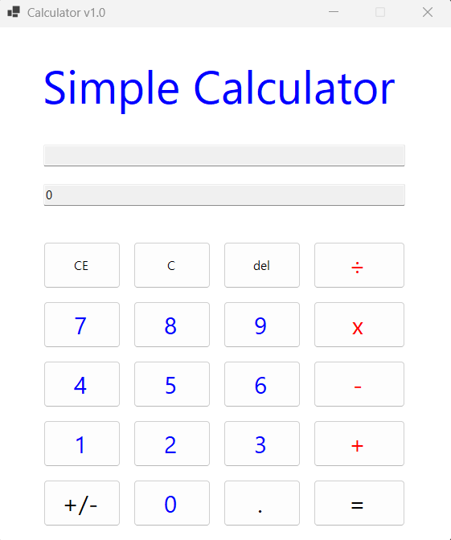
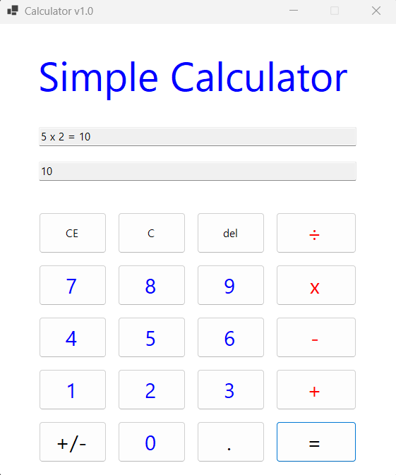
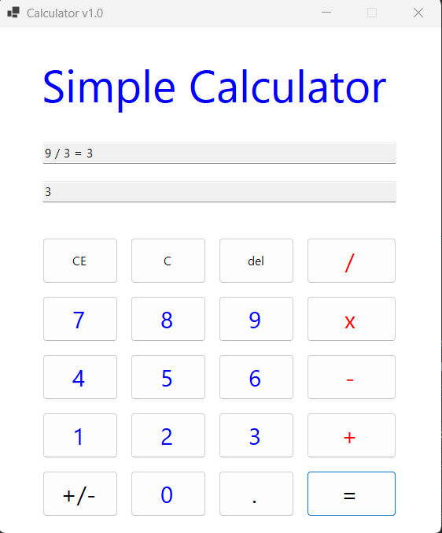
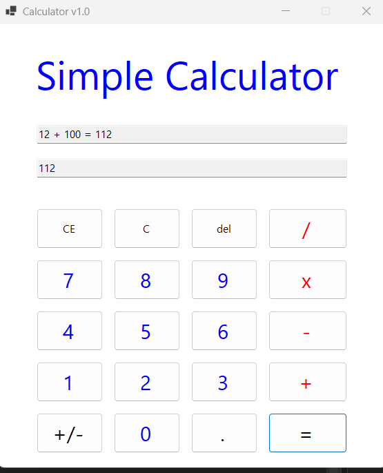
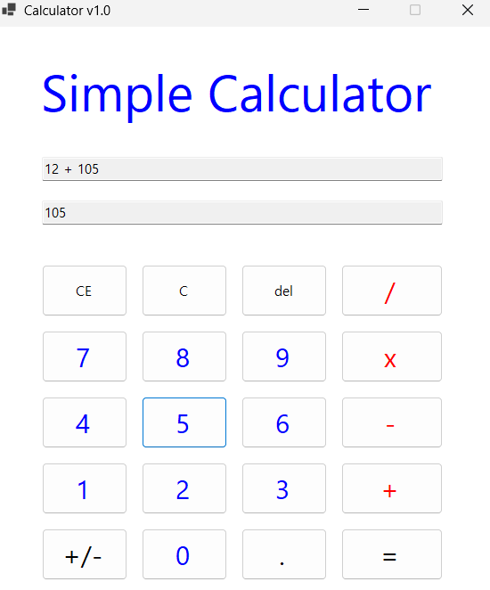
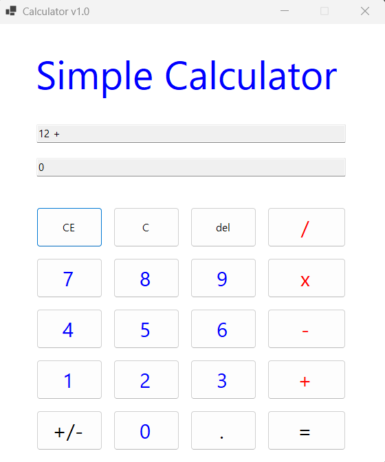

# (C# 코딩) 
	Simple Calculator Application
## 개요
	-C# 프로그래밍학습
	-1줄소개: 사용자가 숫자와 연산자를 입력하여 간단한 계산을 할 수 있는 계산기 애플리케이션입니다.
	-사용한플랫폼: -C#, .NET Windows Forms, Visual Studio, GitHub
	-사용한컨트롤:-Label, TextBox, ListBox, Button
	-사용한기술과구현한기능:
	-수업중에배우고사용했던클래스들관련된설명
	-실습중에구현한기능들설명

## 실행화면(과제1)
-과제1코드의실행스크린샷

-과제내용
	
	- Label(제목), TextBox(수식 표시), TextBox(결과 표시), Button(숫자 및 연산자)을 적절히 배치합니다.
	- 숫자 버튼을 누르면 입력한 값이 TextBox에 표시되도록 구현합니다.
	- 더하기 연산자(`+`)를 누르면 첫 번째 값을 저장하고 다음 입력을 받을 수 있도록 합니다.
	- 결과 보기 버튼(`=`)을 누르면 두 수를 더한 결과가 TextBox에 표시되도록 구현합니다.

-구현내용과기능설명

	- 숫자 버튼을 누르면 입력한 숫자가 화면에 순서대로 표시됩니다.
	- `+` 버튼을 누르면 현재 입력된 값을 첫 번째 숫자로 저장하고, 다음 숫자를 입력할 수 있도록 준비합니다.
	- 두 번째 숫자를 입력한 뒤 `=` 버튼을 누르면 두 값을 더한 결과가 결과창에 표시됩니다.
	- 계산이 끝난 뒤에는 다시 숫자를 입력하여 새로운 계산을 이어서 할 수 있습니다.

## 실행화면(과제2)
-과제2코드의실행스크린샷

-과제내용
	
	- 뺄셈(`-`), 곱셈(`x`), 나눗셈(`/`) 버튼을 추가합니다.
	- 각 버튼 클릭 시 연산자만 변경하여 동일한 계산 로직을 적용합니다.
	- 버튼을 누르면 선택한 연산자에 따라 결과가 계산되어 표시되도록 구현합니다.

-구현내용과기능설명

	- 기존 덧셈 기능에 이어 뺄셈, 곱셈, 나눗셈 기능을 추가하였습니다.
	- 숫자를 입력한 뒤 연산자 버튼(`+`, `-`, `x`, `/`) 중 하나를 누르면 첫 번째 피연산자(operand1)와 연산자(op)를 저장합니다.
	- 두 번째 숫자를 입력한 후 `=` 버튼을 누르면 두 번째 피연산자(operand2)를 저장한 뒤, 저장된 연산자에 맞는 계산을 수행합니다.
	- 계산 결과는 아래쪽 txtResult에 결과값만 표시되고, 위쪽 txtExpress에는 5 x 2 = 10과 같이 전체 수식과 결과가 함께 표시됩니다.
	- 하나의 공통 계산 로직 안에서 연산자 값만 비교하여 사칙연산이 처리되도록 구현하였습니다.
	
## 실행화면(과제3)
-과제3코드의실행스크린샷

-과제내용
	
	- C 버튼
		- 현재의 모든 내용을 삭제하고 처음 상태로 되돌아가도록 구현합니다.
	- CE 버튼
        - 마지막으로 입력한 피연산자(Operand) 값을 통째로 삭제하도록 구현합니다.
		- 예: 12 + 100 상태에서 CE 버튼을 누르면 100이 전체 삭제됩니다.
	- Del 버튼
		- 마지막으로 입력한 글자 하나(숫자 하나)만 삭제하도록 구현합니다.
		- 예: 12 + 100 상태에서 Del 버튼을 누르면 100이 10으로 변경됩니다.

-구현내용과기능설명
	
	- C 버튼을 누르면 계산식, 결과값, 저장된 피연산자와 연산자 정보가 모두 초기화되어 처음 상태로 돌아갑니다.
	- CE 버튼을 누르면 현재 입력 중인 마지막 피연산자 전체가 삭제되고, 다음 입력을 받을 수 있도록 준비됩니다.
	- Del 버튼을 누르면 현재 입력 중인 숫자의 마지막 한 자리만 삭제됩니다.
	- 계산기 사용 중 입력 실수를 했을 때 상황에 따라 전체 초기화, 현재 값 전체 삭제, 한 글자 삭제를 각각 구분하여 사용할 수 있도록 구현하였습니다.

