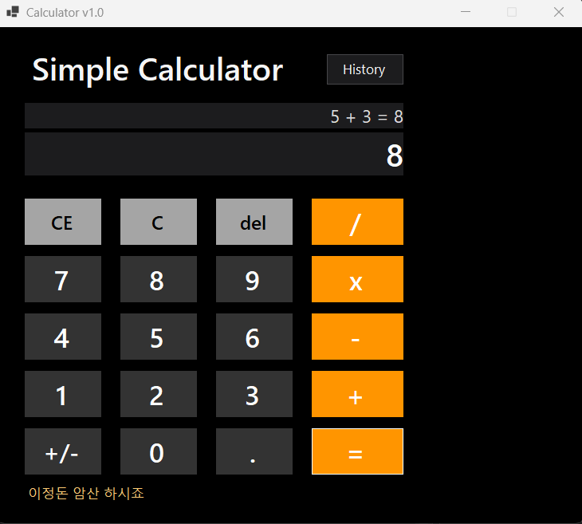
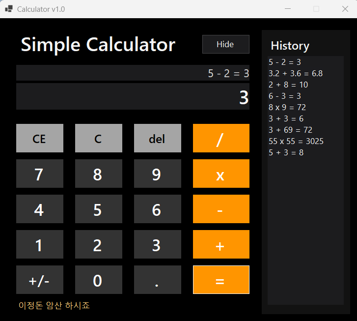
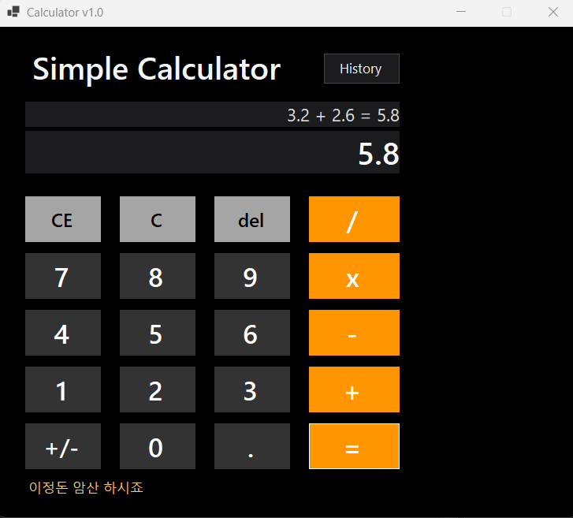
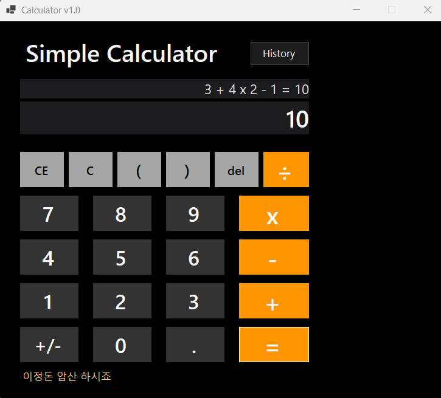
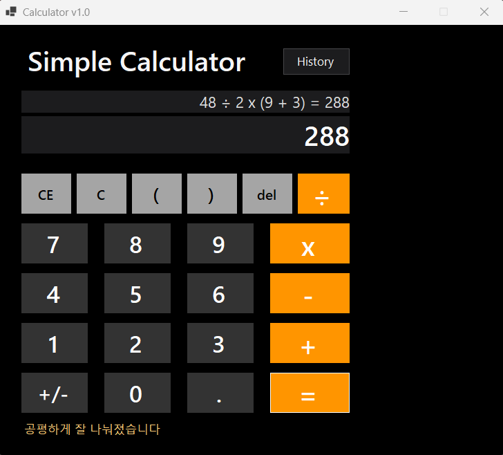

# (C# 코딩) 
	Simple Calculator Application
## 개요
	-C# 프로그래밍학습
	-1줄소개: 사용자가 숫자와 연산자를 입력하여 간단한 계산을 할 수 있는 계산기 애플리케이션입니다.
	-사용한플랫폼: -C#, .NET Windows Forms, Visual Studio, GitHub
	-사용한컨트롤:-Label, TextBox, ListBox, Button
	-사용한기술과구현한기능: 
		- 이벤트 처리
			- Click 이벤트를 사용하여 버튼을 눌렀을 때 각각의 기능이 실행되도록 구현하였습니다.
		- 문자열 처리
			- 입력값과 계산식을 문자열로 저장하고 화면에 표시하였습니다.
		- 형 변환
			- decimal.Parse()를 사용하여 문자열을 숫자로 변환하고, ToString()을 사용하여 계산 결과를 다시 문자열로 변환하였습니다.
		- 조건문
			- if, else if, else를 사용하여 연산자 종류와 상황별 메시지를 구분하였습니다.
	-수업중에배우고사용했던클래스들관련된설명:
		- Panel: 관련된 컨트롤들을 하나의 영역으로 묶어 화면에 배치할 때 사용하는 클래스입니다.
		
		- 문자열(String): 숫자 입력값, 계산식, 상태 메시지 등을 저장하고 출력하는 데 사용하였습니다.
			- txtExpress.Text, txtResult.Text를 통해 문자열 데이터를 다루었습니다.

		- 형 변환: 문자열로 입력된 값을 실제 계산이 가능하도록 숫자형으로 바꾸는 과정입니다.
			- decimal.Parse()를 사용해 문자열을 숫자로 변환하고, ToString()으로 계산 결과를 다시 문자열로 바꾸어 화면에 표시하였습니다.

		- 조건문(if, else if, else): 연산자 종류나 상황에 따라 다른 동작을 하도록 구현하는 데 사용하였습니다.
			- 덧셈, 뺄셈, 곱셈, 나눗셈 처리와 예외 상황, 문구 출력 조건 등에 활용하였습니다.

		- 멤버 변수(Field): 계산기의 현재 상태를 저장하기 위해 클래스 내부 변수들을 사용하였습니다.
			- 예: operand1, operand2, op, isOperating, hasCalculated

		- 메서드(Method): 기능별로 코드를 나누어 관리하기 위해 사용하였습니다.
			- 예: 계산 수행, 화면 업데이트, 메시지 출력, 초기화 기능 등을 각각 메서드로 분리하였습니다.
	
	-실습중에구현한기능들설명

		- 숫자 버튼을 누르면 입력값이 화면에 표시되도록 하였고, 계산식과 결과값을 각각 다른 TextBox에 출력하도록 구성하였습니다.
		- 기본적인 덧셈 기능에서 시작하여 뺄셈, 곱셈, 나눗셈까지 포함한 사칙연산 기능을 구현하였습니다.
		- 계산 결과는 결과값만 따로 출력하는 것뿐 아니라, 전체 식과 함께 표시되도록 하여 계산 과정을 확인할 수 있도록 하였습니다.
		- C, CE, Del 버튼을 추가하여 전체 초기화, 마지막 피연산자 삭제, 마지막 숫자 한 자리 삭제 기능을 구현하였습니다.
		- 사용자의 편의를 위해 연속 계산이 가능하도록 개선하였으며, 소수점 입력과 부호 전환 기능도 함께 구현하였습니다.
		- History 버튼을 누르면 오른쪽에 작은 기록창이 나타나도록 하였고, 계산한 식과 결과가 기록으로 남도록 구현하였습니다.
		- 또한 계산 결과 상황에 따라 재미있는 문구가 출력되도록 하여 프로그램 사용에 흥미를 더하였습니다.
		- 마지막으로 괄호 `(`, `)`를 추가하여 연산자 우선순위를 반영한 계산이 가능하도록 하였고, 곱셈과 나눗셈이 덧셈과 뺄셈보다 먼저 계산되며 괄호 안의 식이 우선 계산되도록 구현하였습니다.

## 실행화면(과제1)
-과제1코드의실행스크린샷

-과제내용
	
	- Label(제목), TextBox(수식 표시), TextBox(결과 표시), Button(숫자 및 연산자)을 적절히 배치합니다.
	- 숫자 버튼을 누르면 입력한 값이 TextBox에 표시되도록 구현합니다.
	- 더하기 연산자(`+`)를 누르면 첫 번째 값을 저장하고 다음 입력을 받을 수 있도록 합니다.
	- 결과 보기 버튼(`=`)을 누르면 두 수를 더한 결과가 TextBox에 표시되도록 구현합니다.

-구현내용과기능설명

	- 숫자 버튼을 누르면 입력한 숫자가 화면에 순서대로 표시됩니다.
	- `+` 버튼을 누르면 현재 입력된 값을 첫 번째 숫자로 저장하고, 다음 숫자를 입력할 수 있도록 준비합니다.
	- 두 번째 숫자를 입력한 뒤 `=` 버튼을 누르면 두 값을 더한 결과가 결과창에 표시됩니다.
	- 계산이 끝난 뒤에는 다시 숫자를 입력하여 새로운 계산을 이어서 할 수 있습니다.

## 실행화면(과제2)
-과제2코드의실행스크린샷

-과제내용
	
	- 뺄셈(`-`), 곱셈(`x`), 나눗셈(`/`) 버튼을 추가합니다.
	- 각 버튼 클릭 시 연산자만 변경하여 동일한 계산 로직을 적용합니다.
	- 버튼을 누르면 선택한 연산자에 따라 결과가 계산되어 표시되도록 구현합니다.

-구현내용과기능설명

	- 기존 덧셈 기능에 이어 뺄셈, 곱셈, 나눗셈 기능을 추가하였습니다.
	- 숫자를 입력한 뒤 연산자 버튼(`+`, `-`, `x`, `/`) 중 하나를 누르면 첫 번째 피연산자(operand1)와 연산자(op)를 저장합니다.
	- 두 번째 숫자를 입력한 후 `=` 버튼을 누르면 두 번째 피연산자(operand2)를 저장한 뒤, 저장된 연산자에 맞는 계산을 수행합니다.
	- 계산 결과는 아래쪽 txtResult에 결과값만 표시되고, 위쪽 txtExpress에는 5 x 2 = 10과 같이 전체 수식과 결과가 함께 표시됩니다.
	- 하나의 공통 계산 로직 안에서 연산자 값만 비교하여 사칙연산이 처리되도록 구현하였습니다.
	
## 실행화면(과제3)
-과제3코드의실행스크린샷

-과제내용
	
	- C 버튼
		- 현재의 모든 내용을 삭제하고 처음 상태로 되돌아가도록 구현합니다.
	- CE 버튼
        - 마지막으로 입력한 피연산자(Operand) 값을 통째로 삭제하도록 구현합니다.
		- 예: 12 + 100 상태에서 CE 버튼을 누르면 100이 전체 삭제됩니다.
	- Del 버튼
		- 마지막으로 입력한 글자 하나(숫자 하나)만 삭제하도록 구현합니다.
		- 예: 12 + 100 상태에서 Del 버튼을 누르면 100이 10으로 변경됩니다.

-구현내용과기능설명
	
	- C 버튼을 누르면 계산식, 결과값, 저장된 피연산자와 연산자 정보가 모두 초기화되어 처음 상태로 돌아갑니다.
	- CE 버튼을 누르면 현재 입력 중인 마지막 피연산자 전체가 삭제되고, 다음 입력을 받을 수 있도록 준비됩니다.
	- Del 버튼을 누르면 현재 입력 중인 숫자의 마지막 한 자리만 삭제됩니다.
	- 계산기 사용 중 입력 실수를 했을 때 상황에 따라 전체 초기화, 현재 값 전체 삭제, 한 글자 삭제를 각각 구분하여 사용할 수 있도록 구현하였습니다.

## 실행화면(과제4)
-과제4코드의실행스크린샷

-과제내용
	
	- Windows 계산기 참고해서 편의기능과 숨어있는 기능을 찾아서 프로그램에 추가합니다.
	- 보면 놀랄만한 멋진 기능을 추가합니다.
	- 곱셈/나눗셈이 덧셈과 뺄셈보다 우선하고 괄호를 사용해 연산 순서를 명확히 지정하도록합니다.

-구현내용과기능설명

	- History 버튼을 누르면 오른쪽에 작은 기록창이 나타나고, 다시 누르면 숨겨지도록 구현하였습니다.
	- 계산이 완료되면 계산식과 결과가 기록창에 한 줄씩 저장되도록 구현하였습니다.
	- 계산 결과 상황에 따라 재미있는 문구가 아래쪽 안내 영역에 표시되도록 구현하였습니다.
	- 연속 계산이 가능하도록 식 전체를 이어서 입력하고 계산할 수 있게 하였습니다.
	- 괄호 버튼 `(`, `)`를 추가하여 수식 안에서 연산 우선순위를 반영할 수 있도록 하였습니다.
	- 곱셈과 나눗셈이 덧셈과 뺄셈보다 먼저 계산되며, 괄호가 있는 경우 괄호 안을 먼저 계산하도록 구현하였습니다.

